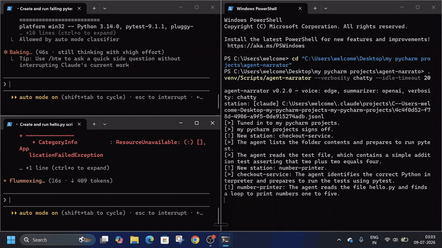

# agent-narrator-for-windows

**Basically Hear your coding agents work.** It's a terminal-native CLI that tails every live
agent session on your machine (Claude Code and Codex), distills each step into
one calm spoken line with a bring-your-own-key LLM, and reads it aloud. Errors
and "the agent needs you" moments always speak first(so your work never stops), and every agent announces
when it goes idle or gets back to work.

Run a stack of agents without staring at a stack of terminals.



> 🔊 The GIF above is silent — **[watch the demo with sound](https://youtu.be/pVhT7h2hiDE)**.

_Python 3.10+ · Windows, Linux, macOS · MIT._

## Why this exists

[Agent FM](https://www.agentfm.ai/) (YC S26) had a great idea — turn your coding
agents into something you can *hear* — but it's a macOS-only app, and I'm on
Windows. So I built my own take: cross-platform, terminal-native, open source,
and it watches **multiple** agents at once. Same core idea, different machine,
and you can read every line of it.

## How it works

```
~/.claude/projects/**/*.jsonl   ~/.codex/sessions/**/*.jsonl   (appended live)
        │                              │
        ▼                              ▼
   sources.py — discover sessions + parse each format into events
        │
        ▼
   multiplexer.py — every active session is a "station": own handle,
        │            own batch, own idle clock; new sessions join live,
        │            stale ones sign off
        ▼
   summarizer.py ──► tts.py
    ONE spoken line     shared speech queue: per-station newest-state-wins,
    per station batch   errors jump everyone, station names prefix the lines
```

- **Never falls behind.** TTS runs on a worker thread; stale lines are dropped so
  you always hear the *newest* state, and errors/attention jump the queue.
- **Great voice for free.** The default voice is a Microsoft Edge neural voice
  (`edge-tts`) — surprisingly natural-sounding, no key. A paid `OPENAI_API_KEY` upgrades to
  OpenAI TTS; `--local` drops to a fully offline voice.

## Install

```bash
git clone https://github.com/AnSa30-06/agent-narrator-for-windows
cd agent-narrator-for-windows
pip install -e .        # or: pipx install .
```

Python 3.10+. On Linux the offline voice needs espeak:
`sudo apt install espeak-ng libespeak1`.

## Quickstart

```bash
cp .env.example .env    # add OPENAI_API_KEY or GEMINI_API_KEY (optional)
agent-narrator          # tunes into EVERY active agent session (up to 6)
```

Then use Claude Code (or Codex) in other terminals and listen. With several
agents running you hear station-prefixed lines — "checkout-service: three tests
fail around tax rounding" — plus "X has gone idle" / "X is back at work" as each
agent stops and starts.

No key? It works out of the box:

```bash
agent-narrator --no-llm --local
```

Replay a finished session as a spoken story (the quickest way to hear it, sort of like a podcast):

```bash
agent-narrator --replay --session ~/.claude/projects/<project>/<session>.jsonl
```

## Flags

| Flag | Default | What it does |
|------|---------|--------------|
| `--sources LIST` | `claude,codex` | Which agent transcripts to watch |
| `--stations N` | `6` | Max concurrent sessions narrated at once |
| `--session PATH` | — | Narrate ONE specific session `.jsonl` (single-station mode) |
| `--replay` | off | (with `--session`) read the whole session, then exit |
| `--projects-dir PATH` | `~/.claude/projects` | Claude Code sessions location |
| `--codex-dir PATH` | `~/.codex/sessions` | Codex sessions location |
| `--provider {auto,openai,gemini,none}` | `auto` | LLM for narration lines |
| `--no-llm` | off | Template lines, zero keys needed |
| `--local` | off | Force fully offline TTS (pyttsx3) |
| `--mute` | off | Print lines, speak nothing |
| `--voice NAME` | `en-US-AriaNeural` | Edge neural voice (`edge-tts --list-voices`), or an OpenAI voice like `alloy` |
| `--verbosity {quiet,normal,chatty}` | `normal` | quiet = errors/attention only; chatty = +your own messages |
| `--idle-timeout SECONDS` | `25` | Silence before a station is announced idle |

## Keys (`.env`)

The **voice is free by default** (Edge neural — no key at all). Any one of these
unlocks LLM narration lines (all optional):

- `OPENAI_API_KEY` — gpt-4o-mini lines **and** the OpenAI TTS voice
- `OPENROUTER_API_KEY` — any OpenAI-compatible model for lines
  (`OPENAI_BASE_URL` + `OPENAI_MODEL` for other compatible endpoints)
- `GEMINI_API_KEY` — gemini flash lines

A full session narrates for well under $0.05 with gpt-4o-mini.

## Behavior details

- Start a new agent mid-broadcast? Its station joins live ("New station:
  my pycharm projects") at the current moment, never replaying old history. Stations that
  go quiet sign off and free their slot for a busier one.
- Each station announces "has gone idle" / "is back at work", so you always know
  which agents are actually doing something.
- Assistant "thinking"/"reasoning" blocks are never narrated. Claude subagent
  sidechains are skipped.
- Attention detection: questions and approval/permission/blocked phrasing are
  spoken immediately, ahead of everything else.
- One chatty agent can't drown out a quiet one: stale-line dropping is
  per-station, and errors from any station will jump the whole queue. So priority does exist.
- `Ctrl-C` signs off cleanly.
